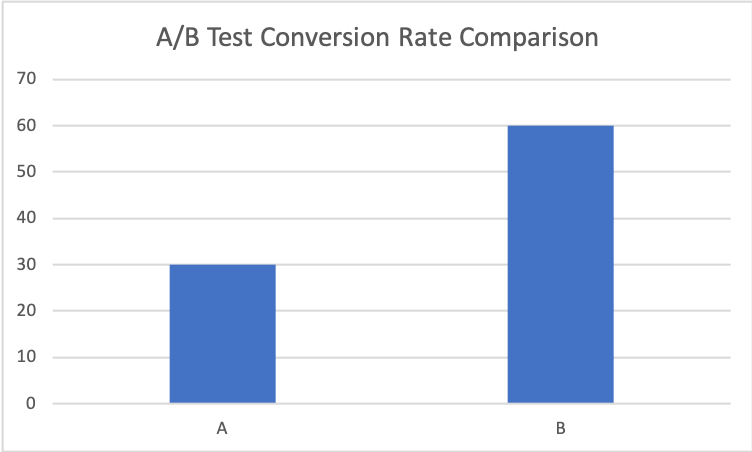

# A/B Testing SQL Analysis

SQL-based experiment analytics project demonstrating A/B test evaluation, KPI analysis, segmentation, and business recommendations.

## Overview

This project simulates a real-world A/B testing scenario where two variants, A and B, are compared across user engagement, conversion, and revenue metrics. The goal is to evaluate which variant performs better and provide a business recommendation based on the results.

## Objectives

- Analyze experiment performance using SQL
- Compare conversion and revenue metrics across variants
- Evaluate segment-level performance by device and region
- Demonstrate business-oriented interpretation of test results
- Showcase AI-assisted analytics workflows

## Project Structure

- `data/` contains experiment dataset
- `sql/` contains schema, core metrics, and segment analysis queries
- `docs/` contains AI-assisted development notes

## Key Metrics

The project defines and analyzes the following business metrics:

- Total users exposed
- Click-through rate (CTR)
- Conversion rate
- Click-to-conversion rate
- Total revenue
- Revenue per user

## Analysis Questions

This project is designed to answer:

- Which variant performs better overall?
- Does one variant generate higher conversion rates?
- Which variant drives more revenue per user?
- Do results vary by device or region?
- What decision should stakeholders make based on the results?

## Sample Insights

Based on the analysis, Variant B outperforms Variant A on conversion and revenue efficiency. Segment-level analysis also helps identify which device types and regions show the strongest response to the experiment.

## Visualization

## Final Recommendation

Based on the analysis, Variant B demonstrates higher conversion rates and stronger revenue performance across multiple segments. 

Recommendation:
- Roll out Variant B to all users
- Continue monitoring performance with larger sample sizes
- Conduct follow-up experiments for optimization

This reflects how experimentation results are translated into business decisions.

## Business Recommendation

If the observed pattern continues at scale, Variant B should be prioritized because it delivers stronger conversion performance and higher revenue contribution. Additional testing with larger samples would strengthen decision confidence.

## Technologies Used

- SQL
- Business Intelligence and Experiment Analysis
- GitHub
- AI-assisted development using GitHub Copilot and Claude

## Business Impact

This project demonstrates how experimentation and KPI analysis can be used to:

- Measure product or campaign effectiveness
- Compare alternative user experiences
- Identify high-performing user segments
- Support data-driven business decisions

## Future Enhancements

- Add statistical significance testing
- Add funnel analysis for multi-step conversion journeys
- Visualize experiment results in Power BI or Tableau
- Extend analysis to retention and cohort behavior

